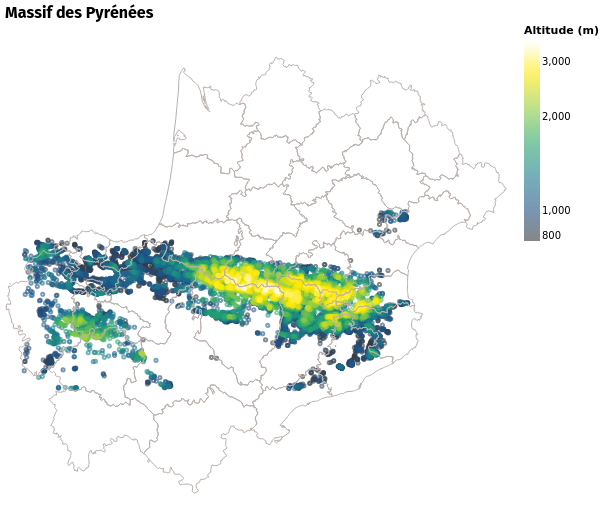
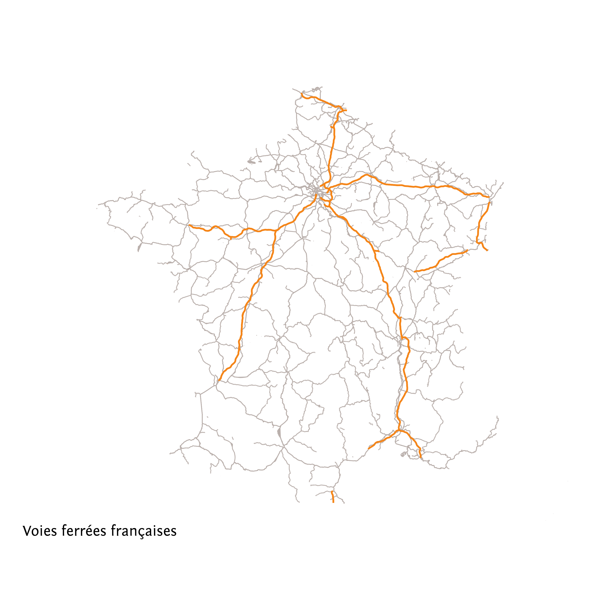
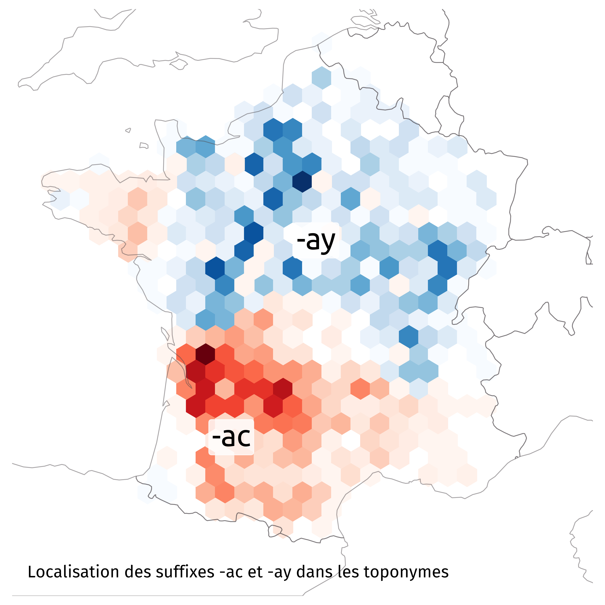
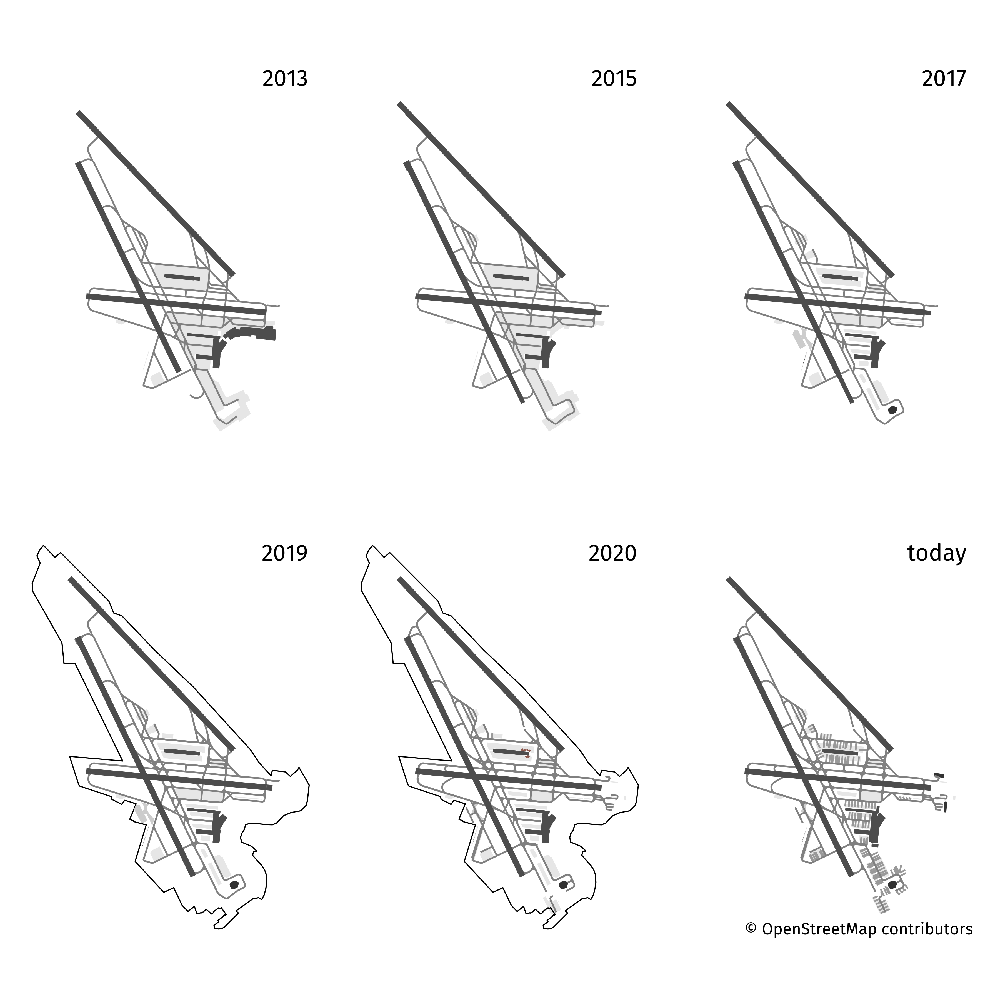

# 30 day map challenge

### Day 1 – Points

### Day 2 – Lines

### Day 3 – Polygons

### Day 4 – Hexagons

### Day 5 – Data challenge 1: OpenStreetMap

### Day 6 – Red

### Day 7 – Green

### Day 8 – Blue

### Day 9 – Monochrome

### Day 10 – Raster

### Day 11 – 3D

### Day 12 – Population

### Day 13 – Data challenge 2: Natural Earth

### Day 14 – Map with a new tool

Details here: https://observablehq.com/@xoolive/disputed-territories

### Day 15 – Map made without a computer

Following the instructions from James Monteith's Comprehensive Geography to draw a map of Europe.

### Day 16 – Urban/rural

### Day 17 – Land

### Day 18 – Water

### Day 19 – Islands

### Day 20 – Movement

### Day 21 – Elevation

### Day 22 – Boundaries

