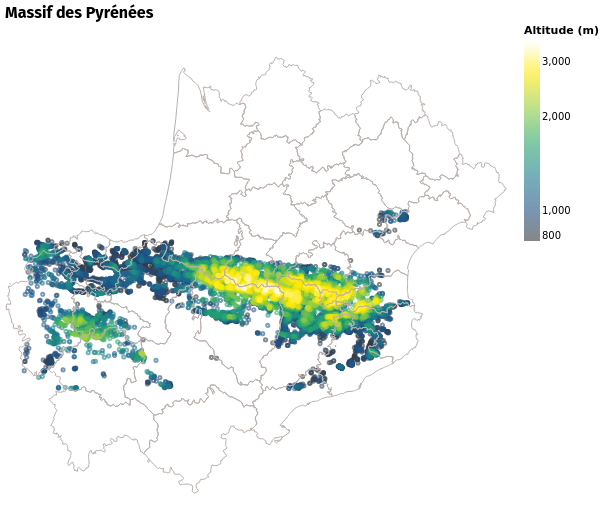
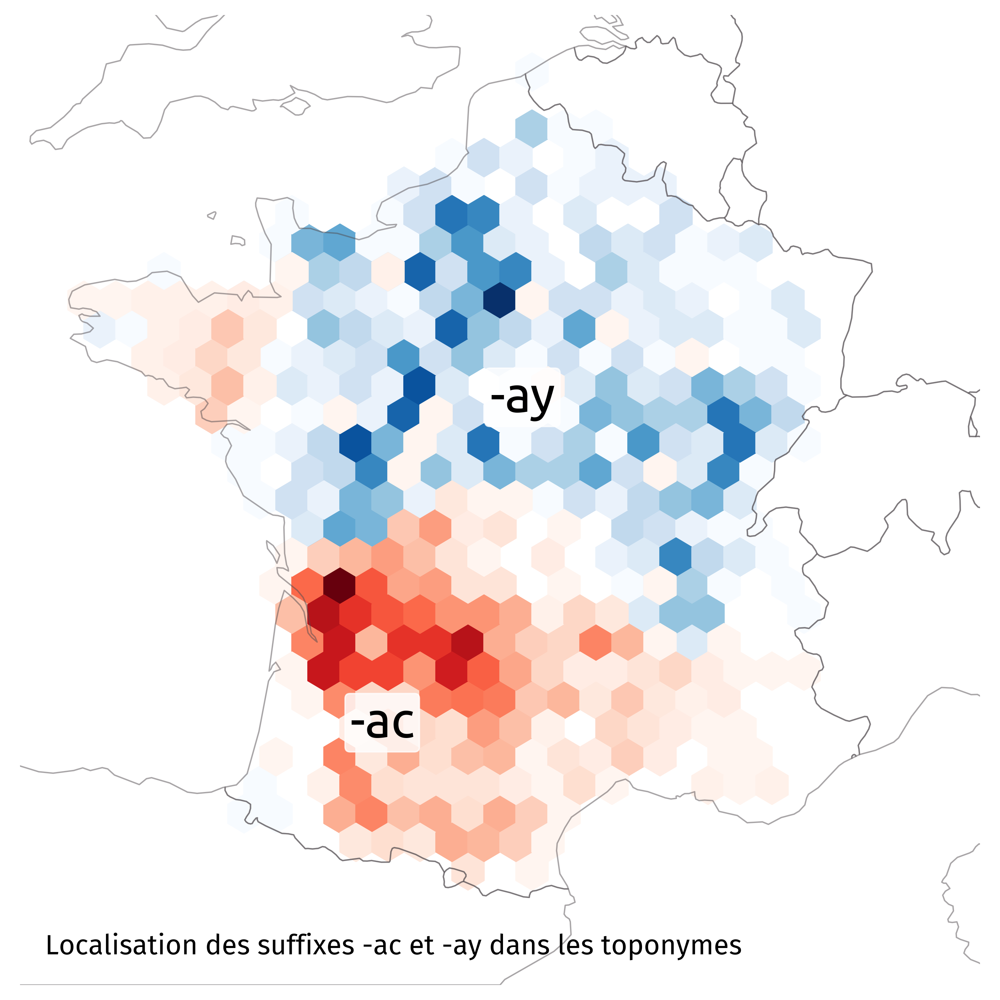
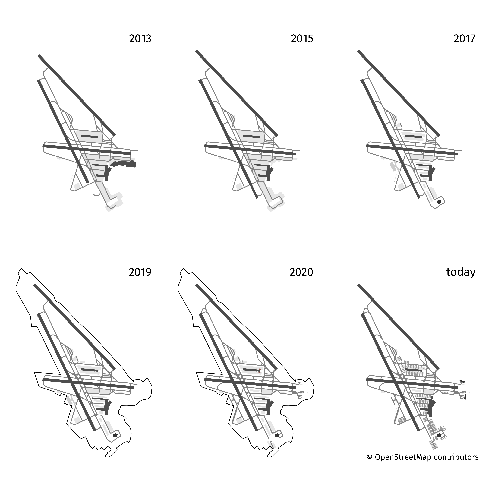
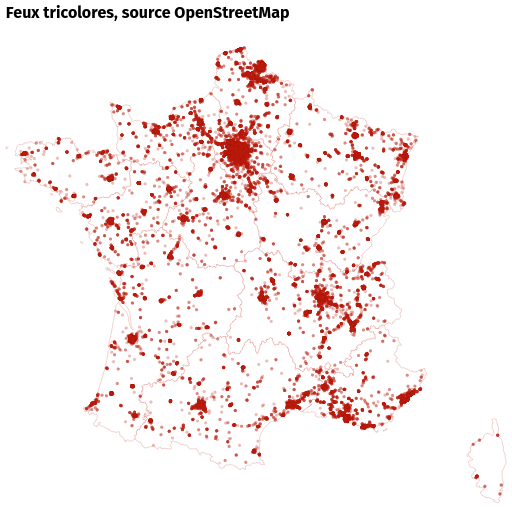
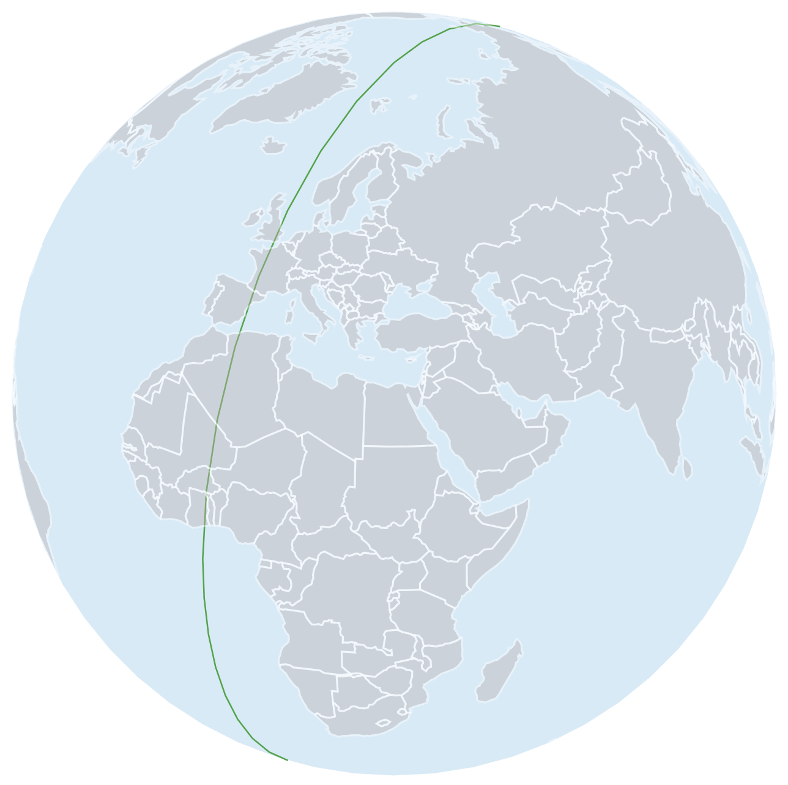
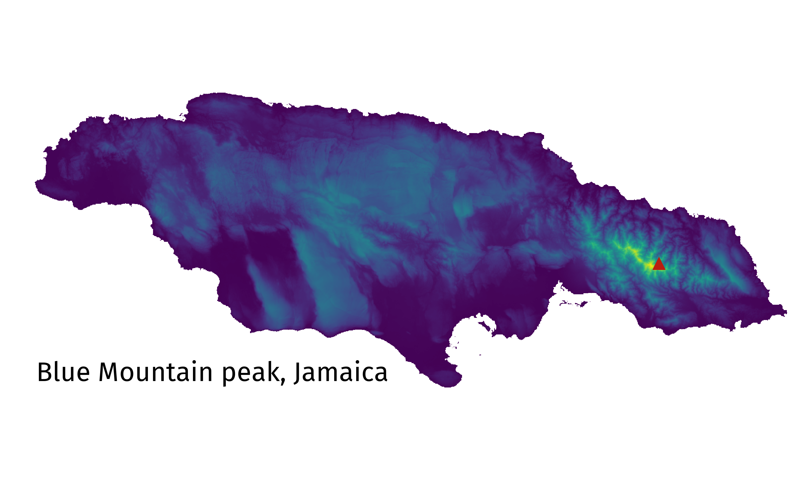
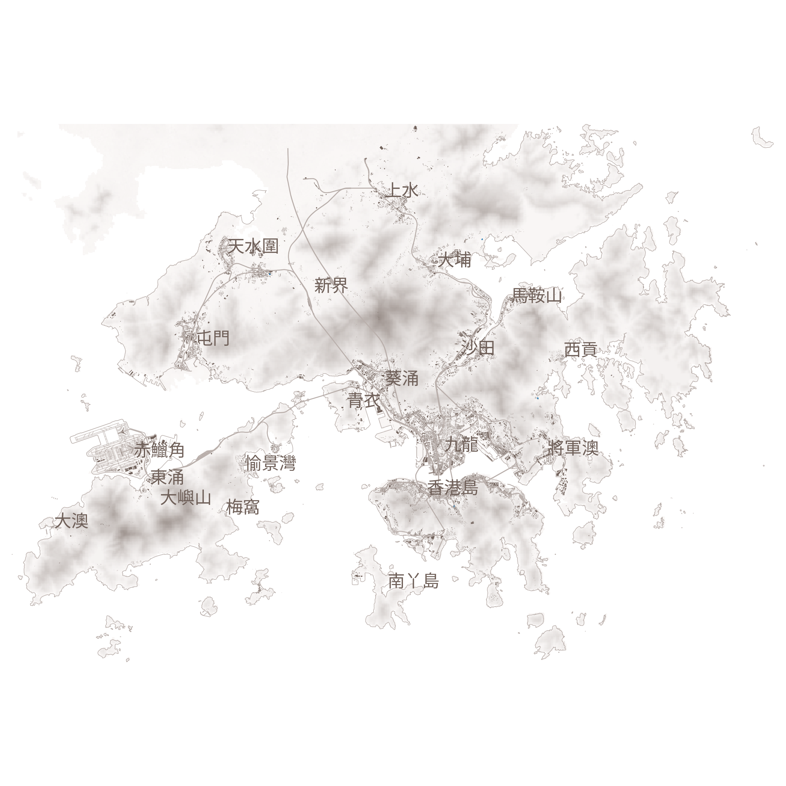

# 30 day map challenge

### Day 1 – Points

### Day 2 – Lines

### Day 3 – Polygons

### Day 4 – Hexagons

### Day 5 – Data challenge 1: OpenStreetMap

### Day 6 – Red

### Day 7 – Green

### Day 8 – Blue

### Day 9 – Monochrome

