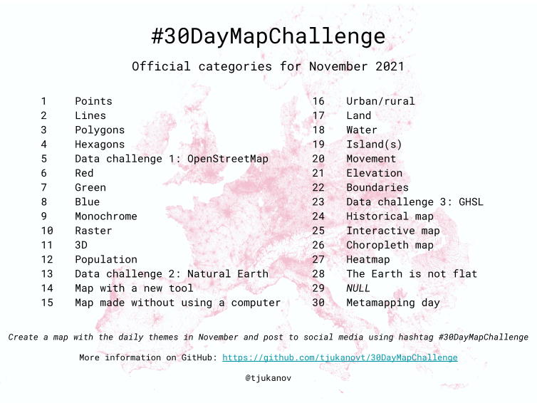

# 30 day map challenge

My mapping tools usually include:

- Matplotlib, with [Cartopy](https://scitools.org.uk/cartopy/docs/latest/);
- [Altair](https://altair-viz.github.io/gallery/index.html#maps) for a Javascript/Vega-Lite output;
- Extensions about projection and access to OpenStreetMap with my [`cartes`](https://github.com/xoolive/cartes) library, highly dependent on [Shapely](https://shapely.readthedocs.io/en/latest/index.html);

I also appreciate, also I am not (yet?) proficient the d3.js library with the [Observable](https://observablehq.com/@xoolive) environment. Have a look at [@fil](https://observablehq.com/@fil) if you want to be mindblown.

## 2021

- Day 1 -- [Points](2021/01)
- Day 2 -- [Lines](2021/02)
- Day 3 -- [Polygons](2021/03)
- Day 4 -- [Hexagons](2021/04)
- Day 5 -- [Data challenge 1: OpenStreetMap](2021/05)
- Day 6 -- [Red](2021/06)
- Day 7 -- [Green](2021/07)
- Day 8 -- [Blue](2021/08)
- Day 9 -- [Monochrome](2021/09)
- Day 10 -- [Raster](2021/10)
- Day 11 -- [3D](2021/11)
- Day 12 -- [Population](2021/12)
- Day 13 -- [Data challenge 2: Natural Earth](2021/13)
- Day 14 -- [Map with a new tool](https://observablehq.com/@xoolive/disputed-territories)
- Day 15 -- [Map without a computer](2021/15)
- Day 16 -- [Urban/rural](2021/16)
- Day 17 -- [Land](2021/17)
- Day 18 -- [Water](2021/18)
- Day 19 -- [Islands](2021/19)
- Day 20 -- [Movement](2021/20)
- Day 21 -- [Elevation](2021/21)
- Day 22 -- [Boundaries](2021/22)
- Day 23 -- [Data Challenge 3: GHSL](2021/23)
- Day 24 -- [Historical map](2021/24)
- Day 25 -- [Interactive map](2021/25)
- Day 26 -- [Choropleth map](2021/26)
- Day 27 -- [Heatmap](2021/27)
- Day 28 -- [The Earth is not flat](2021/27)
- Day 29 -- [`NULL`](2021/28)
- Day 30 -- [Metamapping day](2021/30)
